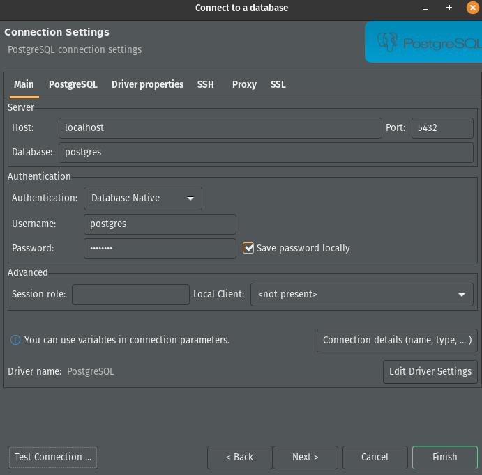

# Postgresql & PgAdmin powered by compose

## Requirements:
* docker >= 17.12.0+  
* docker-compose

## Quick Start
* Clone or download this repository
* Go inside of directory,  `cd compose-postgres`
* Run this command `docker-compose up -d`
* (Recommended) Check if the containers are up and running with `docker ps`

## Stop 
* Run this command `docker-compose down`  

## Environments
This Compose file contains the following environment variables:

* `POSTGRES_USER` the default value is **postgres**
* `POSTGRES_PASSWORD` the default value is **postgres**
* `PGADMIN_PORT` the default value is **5050**
* `PGADMIN_DEFAULT_EMAIL` the default value is **null@null.com**
* `PGADMIN_DEFAULT_PASSWORD` the default value is **admin**

## Access to postgres: 
* `localhost:5432`
* **Username:** postgres (as a default)
* **Password:** postgres (as a default)

## Access to PgAdmin: (Optional) 
* **URL:** `http://localhost:5050`
* **Username:** null@null.com (as a default)
* **Password:** admin (as a default)

## Add a new server in PgAdmin: (Optional)
* **Host name/address** `postgres`
* **Port** `5432`
* **Username** as `POSTGRES_USER`, by default: `postgres`
* **Password** as `POSTGRES_PASSWORD`, by default `postgres`

## Add to DBeaver

* **Host name/address** `localhost`
* **Port** `5432`
* **Username** as `POSTGRES_USER`, by default: `postgres`
* **Password** as `POSTGRES_PASSWORD`, by default `postgres`
